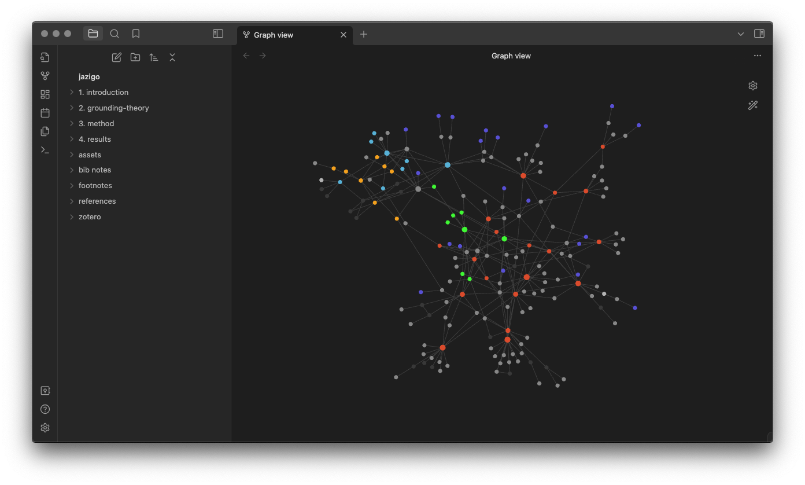

# PhD THESIS: The Experience of Design Education on Digital Platforms

> “It would seem that you have no useful skill or talent whatsoever,” he said. “Have you thought of going into teaching?”
> ― Terry Pratchett, _Mort_ (2012)

---

This repository encloses my Doctorate research as it was — with minor corrections, some changes and some aditions — at the time it passed its qualifying phase, when it was evaluated by the mandatory board exam in May 16th, 2023. I’ve converted it from its original form to an [Obsidian vault](https://help.obsidian.md/Getting+started/Create+a+vault): that’s why its called “Jazigo”. 

The original text in PDF as submited to the board exam was translated to English with a little help from ChatGPT and obviously revised later, as ChatGPT proved to be a bit biased and even tried to change the meaning of the text in some occasions. I also added all my reading notes (_fichamentos_) from all references cited, to ground my work-in-process theory to its theoretical foundations. Those notes weren't translated, though.

My research is guided by the Grounded Theory method. There is still a lot to do: it was recently approved by the Committee for Ethics in Research in Humanities and Social Sciences of Universidade Federal do Paraná, and soon I will start interviewing people, but the interviewing of bibliographical data are still in course. Soon I will build another repository to deal with the Grounded Theory itself.

You can see my slide presentation for the board exam by [clicking here](http://fabianelima.com/UFPR/quali).

## Abstract
This research, in its qualifying phase, emerges from questions about the experiences of teaching and learning Design mediated by digital platforms, activities made possible by infrastructural changes in communication media access over the last two decades; due to the needs brought about by the Covid-19 pandemic, these processes were intensified. The objective of this work is to investigate students’ and professors’ practices and experiences in the context of higher education and Design learning in its various specialties and aspects, mediated by platforms; the aim is to investigate the set of skills, programs, and statements about the area practiced in these digital environments. In order to fulfil this major objective, it will be necessary to fulfil the following specific objectives: to understand the human interactors relationships in the Design education context, mediated by platforms’ languages and interface encapsulations; contribute in the platformisation phenomenon conceptualization, from the perspective of Design education; unveil, in an interpretive and comparative way, fundamental points of Design teaching and learning practices, both in platform education and that provided by formal institutions; and to create a substantive theory related to Design education, understanding platformisation as a problem of Information Systems studies. This research is guided by the Grounded Theory method, and addresses the problem of the educational experience on digital platforms, framing these platforms as manifestations of sociotechnical processes, rather than mere artefacts, placing this problem necessarily in the category of wicked problems. As a wicked problem, platformisation is an ongoing phenomenon —therefore, incomplete—, contradictory in its manifestations and consequences due to its changing nature. Its processes profoundly affect education and work in general, especially work and training in Design. At the same time that platformisation allows education and work expansion beyond geographic boundaries of a given territory —or even the physical boundaries of face-to-face and remote activities, and the temporal boundaries of synchronicity and asynchronicity— it also turns the creation of a propitious environment for job and educational insecurity technologically feasible.

**Keywords**: design education; platformization; mediations; experience; wicked problems.

---

## Table of Contents

- 1. [Introduction](https://github.com/fabianelima/jazigo/tree/main/jazigo/1.%20introduction)
- 2. [Grounding Theory](https://github.com/fabianelima/jazigo/tree/main/jazigo/2.%20grounding-theory)
- 3. [Method](https://github.com/fabianelima/jazigo/tree/main/jazigo/3.%20method)
- 4. [Results](https://github.com/fabianelima/jazigo/tree/main/jazigo/4.%20results)

---

Universidade Federal do Paraná

Programa de Pós-Graduação em Design

Advisor: Professor Dr. Carolina Calomeno

Curitiba, 2023